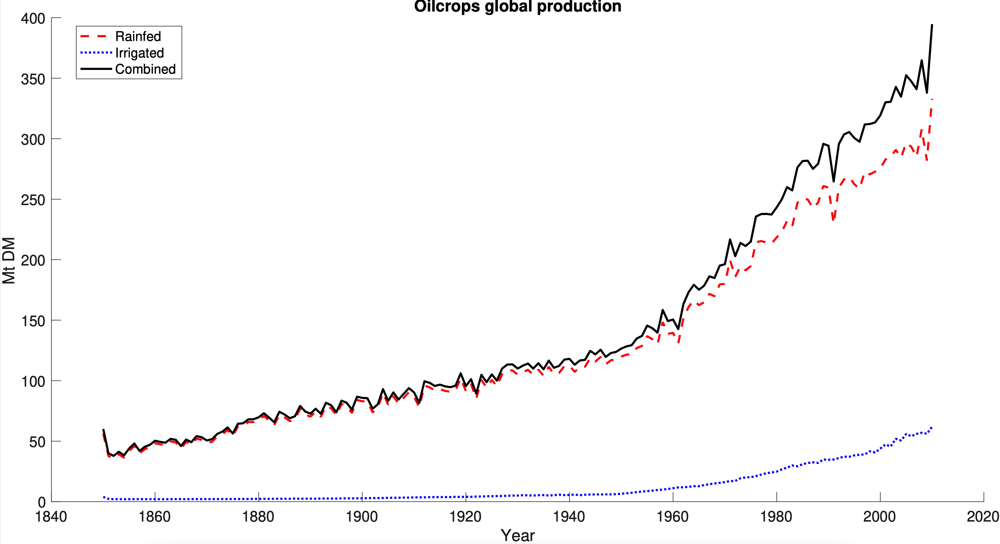
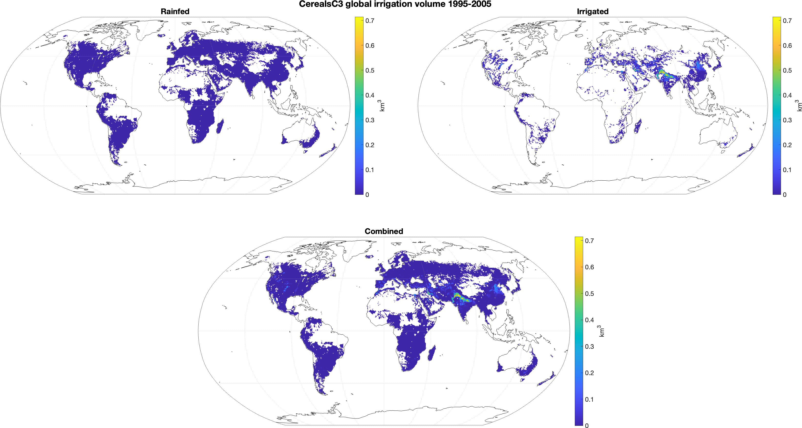

# MATLAB scripts for working with LandSyMM

For these scripts to work, you must have a file called `landsymm_lpjg_path.m` in your [MATLAB path](https://www.mathworks.com/matlabcentral/answers/116177-how-to-add-a-folder-permanently-to-matlab-path). It should look something like this:

```matlab
function myPath = landsymm_lpjg_path()
myPath = '/path/to/your/copy/of/this/repo' ;
end
```

Most of these scripts and functions were originally written to work on my laptop. As needed, I will update them for portability and generalized functionality. When I do so, I'll add them to this list and give some explanatory text below.

- `crop_diagnostics.m`
- `get_calibration_factors.m`
- `get_max_oilsug.m`

## Produce some diagnostic figures for crop outputs

Use `crop_diagnostics.m` to make area-weighted global timeseries as well as time-averaged maps for crop variables like yield, irrigation (`gsirrigation.out`), etc.






## Generate calibration factors

(This isn't something you'll have to do often, but it will come up.) LPJ-GUESS doesn't simulate every kind of crop that PLUM wants. To translate our crop types into PLUM's crop types, we use *calibration factors*. These are values that PLUM multiplies the LPJ-GUESS yields by to get an adjusted yield estimate. To generate calibration factors, we perform a simple LPJ-GUESS run with historical CO2, reanalysis climate (I've been using ISIMIP3a GSWP5-W5E5), and historical land use. We then point `get_calibration_factors.m` at the outputs; that script has more details and instructions on its use.

## Combine crops in LPJ-GUESS output before sending to PLUM

As of 2022-12-27, I'm doing yield-generating runs that include some crops that PLUM doesn't. This is because PLUM has one general demand category for crops with radically different physiologies. Where PLUM ← LPJG1, LPJG2:

- Oilcrops ← OilNfix (N fixers; planted with `TeSo`), OilOther (non-N fixers; planted with `TeSW`)
- Sugar ← Sugarbeet (C3; planted with `TeSW`), Sugarcane (C4; planted with `TeCo`)

These LPJ-GUESS crops need to be somehow chosen between or combined before sending the outputs to PLUM. For now, this is a manual process using the script `general_tasks/get_max_oilsug.m`, which contains more details and instructions.

